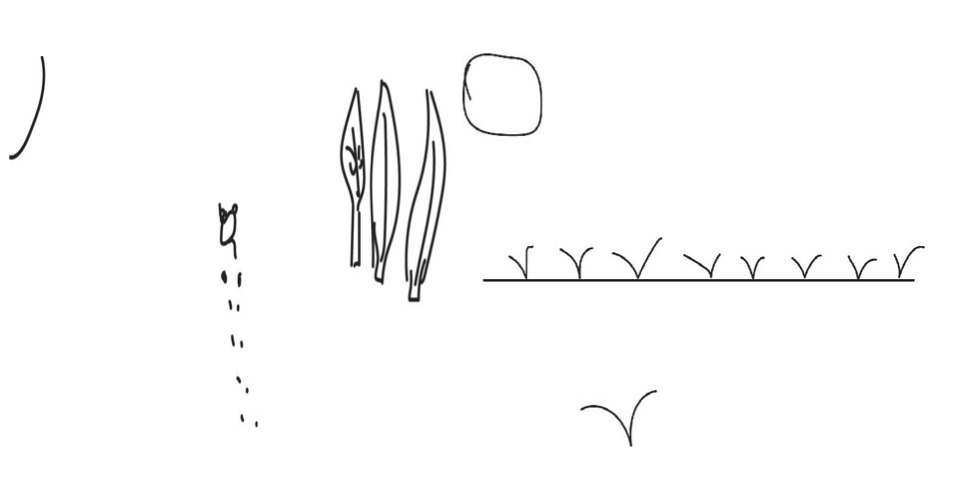

## MDDN 242 Project 1: Time-based Media  

## Introduction to clock concepts:
###### My designs are based on the history of timekeeping. Time is invisible, but it can be measured. Therefore, I intend to express my design in this simple and visible way.
###### Time itself cannot be measured, but because of the existence of everything in the world, time becomes measurable. In my opinion, everything in the world is inextricably related to time. Therefore, my design will focus on emphasizing the connection between everything in the world and time.

### Part 1: Sketch.

###### I have two concepts about designing clocks. They are both designed based on the behavior of a cartoon character. I want to use this to express the relationship between everything in the world and time.
###### The first design protagonist is a cat, and the scene is of the cat walking in the forest. Cats leave their footprints wherever they walk.
###### The second design protagonist is a lot of birds. The change of time will be related to the bird staying on the wire and flying away, and other elements will be added later.

### Part 2: Maeda clock

###### Because I learned coding the year before last, I feel like I have forgotten a lot of the content. For this reason, I don't code the clock myself. I followed the tutorial in my teacher's class and practiced how to create a clock. Through this exercise, I slowly recalled some coding patterns.

### Part 3: Original Clock

###### The current design is basically in line with my original idea. The x-axis movement of flower 1 changes both color and size over time. The petals of flower 2 can rotate with the frequency of time and move along the x-axis like flower 1. Trees currently have no value assigned to movement. The grass in front realizes the cyclic movement of the x-axis over time. By loading pictures, the cat can be made to move. I used the code I learned in class to draw a sun that changes color from orange to red and changes size at the same time. But I'm thinking about the sun not being a harmonious color in the picture.

### Part 4: Clock Alarm

###### If the alarm is not set (< 0), there is a cloud in the sky.
If the alarm is currently ringing (= 0), a transparent red mask appears, along with the specific time and 'Every day people are learning the meaning of time'
The number of seconds (>0) before the alarm goes off and the sun rapidly zooms in and out over time.

### Part 5: Final Clock

###### In the final design, the cat was replaced with a seagull because what was needed in this design was a side view. I think the seagull is more distinctive than the side view of the cat. So in general, this design is that the movement of seagulls and plants represent seconds, the color change of flowers represents minutes, and the color change of hearts represents hours.
###### The design of the heart here represents energy, which will pass over time. A heart's energy is lost every two hours.
###### The setting of the alarm clock is as above. When the sun replaces the alarm clock <0 a few minutes before the alarm clock, the sun will zoom in and out to serve as a reminder. When >0, a pink mask will appear to block the screen, and text and the exact time will appear to remind you.

##### *The seagull represents people's daily state. The time we spend every day is the process of learning the meaning of time.*

